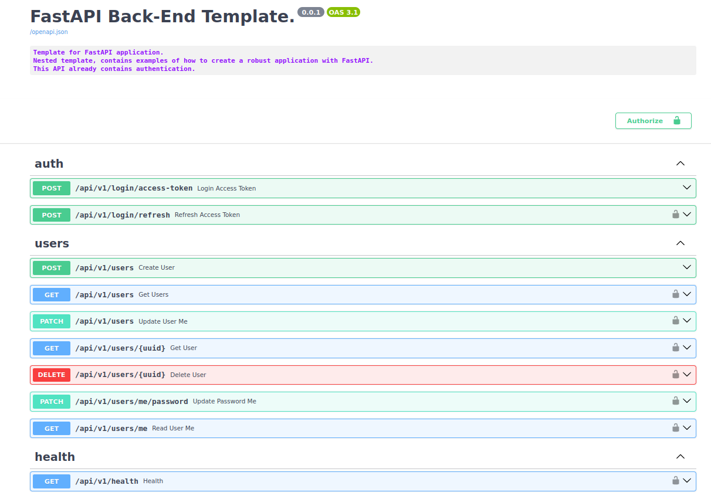

<p align="center">
  <a href="https://fastapi.tiangolo.com"></a>
</p>

<p align="center">
  <a href="https://github.com/tiangolo/fastapi/actions?query=workflow%3ATest+event%3Apush+branch%3Amaster" target="_blank">
      
  </a>
  <a href="https://coverage-badge.samuelcolvin.workers.dev/redirect/tiangolo/fastapi" target="_blank">
      
  </a>
  <a href="https://pypi.org/project/fastapi" target="_blank">
      
  </a>
</p>

<hr>
The Fastapi template is a repository for microservices. In this template, you will find examples of how to build a robust application with FastAPI.

## Technology Stack and Features

- ⚡ [**FastAPI**](https://fastapi.tiangolo.com) for the Python Back-End API.
  - 🚀 Fast: Supports async/await syntax for routes and database connection.
  - 💪 Robust: Get production-ready code with automatic interactive documentation.
  - 🔐 Security: `OAuth2` with `fastapi.security`.
- ⚡ Template
  - 🧰 [SQLModel](https://sqlmodel.tiangolo.com): For the Python SQL database interactions (ORM).
  - 🐋 [docker Compose](https://www.docker.com): For development and production.
  - ✅ [pytest](https://docs.pytest.org/en/8.0.x/): Unitary tests.
  - 🧰 [alembic](https://alembic.sqlalchemy.org/en/latest/): Database migrations.
  - 📑 [guvicorn-logger](https://docs.gunicorn.org/en/stable/settings.html): Color logger translator.
  - 📑 [pagination](https://uriyyo-fastapi-pagination.netlify.app/): To simplify pagination.
  - 👀 [pylint](https://pylint.org/): Analyses your code without actually running it.
  - 🚀 [fastapi-cache](https://github.com/long2ice/fastapi-cache): Cache using [redis](https://redis.io/).
  - 🔒 [fastapi-limiter](https://github.com/long2ice/fastapi-limiter): Is a rate limiting tool for fastapi routes.
  - 🚀 [nginx](https://nginx.org/en/): HTTP level server, reverse proxy.
  - 🔒 Secure password hashing by default.
  - 🔑 JWT token authentication.
<hr>

### Interactive API Documentation

  Get production-ready code with automatic interactive documentation.
  API documentation at [Docs](http://0.0.0.0:8000/docs).

  [](https://github.com/mateus-rodriguess/fastapi-template)

## How To Use It

You can **just fork or clone** this repository and use it as is.

✨ It just works. ✨

### How to Use a Private Repository

If you want to have a private repository, GitHub won't allow you to simply fork it as it doesn't allow changing the visibility of forks.

But you can do the following:

- Create a new GitHub repo, for example `my-back-end`.
- Clone this repository manually, set the name with the name of the project you want to use, for example `my-back-end`:

  ```bash
  git clone git@github.com:mateus-rodriguess/fastapi-template.git my-back-end
  ```
- Enter into the new directory:

  ```bash
  cd my-back-end
  ```
- Set the new origin to your new repository, copy it from the GitHub interface, for example:

  ```bash
  git remote set-url origin git@github.com:mateus-rodriguess/fastapi-template.git
  ```
- Add this repo as another "remote" to allow you to get updates later:

  ```bash
  git remote add upstream git@github.com:mateus-rodriguess/fastapi-template.git
  ```
- Push the code to your new repository:

  ```bash
  git push -u origin main
  ```

## Run:
  ```bash
    docker compose up -d
  ```

## Migrations

  ```bash
    $ alembic revision --autogenerate -m "Migration message."
    $ alembic upgrade head

  ```

<hr>

## License

This project is licensed under the terms of the MIT license.
